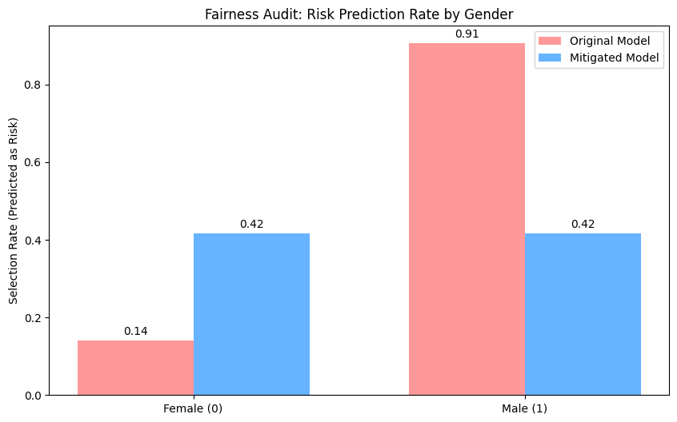

# Algorithmic Fairness & Information Asymmetry in Digital Finance

[Home](../index.md) | [About Me](../about.md)

---

**Theme:** Human-Centered AI / Information Ethics / Fintech

---

## Goal

To audit a credit scoring model for demographic bias and mitigate information asymmetry using *“Fairness, Accountability, and Transparency” (FAccT)* principles.

---

## Tools Used

- **Python** (Scikit-Learn, Pandas)
- **Fairlearn** (Microsoft's bias audit toolkit)
- **Matplotlib** (Data Visualization)

---

## Project Overview

Coming from an agri-fintech background, I investigated how alternative data sources in credit scoring can introduce unintended bias against specific demographics. This project simulates a credit risk scenario using the **Home Credit Default Risk** dataset.

The core research question:  
*How do automated decision systems penalize marginalized groups, and can we fix it without breaking the model?*

---

## Key Findings & Insights

- **Bias Detected:**  
  The baseline Logistic Regression model exhibited severe demographic disparity. It predicted *“High Risk”* for **90.5%** of Male applicants compared to only **14.0%** of Female applicants.

- **Bias Mitigated:**  
  By applying a `ThresholdOptimizer` with **Demographic Parity** constraints, I successfully recalibrated the model.

- **Outcome:**  
  The selection rate was equalized to approximately **41.6%** for both groups, ensuring the algorithm treats applicants based on financial history rather than gender.

---

## Visualizing the Impact

The chart below demonstrates the dramatic shift in selection rates before and after applying the fairness optimization:

---

## Project Files & Code

This project includes a detailed Research Note and the full reproducible Python code.

- **[View Full GitHub Repository](https://github.com/syifbhuiyan/algorithmic-fairness-finance)**
- [Read the Research Note](https://github.com/syifbhuiyan/algorithmic-fairness-finance/blob/main/research_note.md)

---

© 2025 Syif M. Bhuiyan
