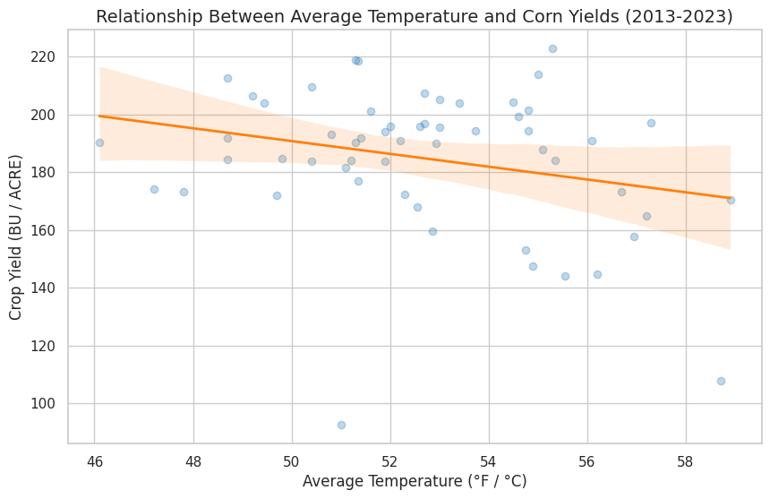

## Panel Data Analysis of Climate Variances on Regional Crop Yields

[Home](../index.html) | [About Me](../about.html)

---

**Theme:** Computational Social Science / Agricultural Economics / Climate

### Goal
To statistically quantify the causal impact of temperature and precipitation variances on county-level crop yields across the US, controlling for unobserved local traits and macroeconomic shocks.

---

### Tools Used
* **Python (Pandas):** For merging misaligned geographic and longitudinal datasets (FIPS codes) and reverse-geocoding coordinates via the FCC API.
* **linearmodels (PanelOLS):** To execute the two-way fixed-effects econometric regression.
* **Seaborn/Matplotlib:** For statistical data visualization.
* **GitHub:** For version control and reproducibility.

---

### Project Overview
Agricultural outputs are highly susceptible to climate volatility, but measuring this impact is difficult due to unobservable variables like local soil quality or national fertilizer price shocks. This project utilizes Computational Social Science techniques to empirically isolate weather impacts using real-world data from the **USDA NASS** and **NOAA**.

I built a data pipeline to merge county-level weather data with annual corn yield outputs, utilizing reverse-geocoding to align inconsistent spatial markers. The data was structured into a multi-index panel to perform advanced econometric analysis.

---

### Key Insights & Findings
* **Methodological Validation (F-test):** The F-test for Poolability yielded a P-value of 0.0014. This is highly statistically significant, confirming that unobserved entity (county) effects exist and that using a Fixed-Effects model was strictly necessary over standard Pooled OLS.
* **Omitted Variable Bias Revealed:** The raw, uncontrolled correlation between temperature and yield appeared negative. However, after controlling for spatial and temporal fixed effects, the model revealed a positive coefficient (2.3979). This demonstrates the danger of Simpson's Paradox in observational data and validates the need for rigorous causal inference methodologies.
* **Statistical Significance Limitations:** Within this specific, filtered 53-observation sample, the climatic variables did not achieve statistical significance at the standard alpha level (Temperature P-value = 0.1443; Precipitation P-value = 0.5891). This suggests that isolated climatic variances within this specific subset did not independently drive yield changes, or a larger multi-state sample size is required to reduce standard errors.

---

### Visualizing the Impact
The chart below visualizes the raw correlation between average temperature and crop yields across the observed counties. While the basic trendline implies a negative relationship, the panel regression proves this is largely driven by unobserved regional differences rather than direct temperature causality.



---

### Code Snippet: The Two-Way Fixed-Effects Model
To eliminate omitted variable bias, I utilized a fixed-effects model to control for time-invariant county traits and national year-over-year shocks.

```python
# Define exogenous variables and add a constant
exog_vars = ['Temp', 'Precip']
exog = sm.add_constant(master_df[exog_vars])
endog = master_df['Yield']

# Fit the Two-Way Fixed Effects Model
# entity_effects=True controls for alpha_i, time_effects=True controls for gamma_t
model = PanelOLS(endog, exog, entity_effects=True, time_effects=True)

# Utilize clustered standard errors for spatial/serial correlation
results = model.fit(cov_type='clustered', cluster_entity=True)
print(results.summary)
```

---

### Project Files & Code
This project includes the full reproducible Python code and datasets.
* [View Full GitHub Repository](https://github.com/syifbhuiyan/climate-crop-panel-analysis)
results = model.fit(cov_type='clustered', cluster_entity=True)
print(results.summary)
