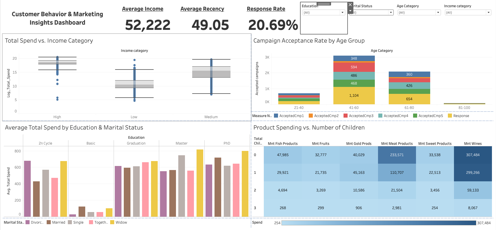

# Tableau Project – Customer Personality Analysis

**Goal**: Analyze customer demographics, spending behavior, and campaign response to uncover insights that can inform marketing strategies.

**Tools Used**: Tableau, Excel

---

## 📝 Dataset Overview

- **Source**: [Kaggle – Customer Personality Analysis](https://www.kaggle.com/datasets/imakash3011/customer-personality-analysis)
- **Records**: ~2,210 customers
- **Columns include**:
  - Demographics: Age, Marital Status, Education, Income
  - Spending: Amount spent on wine, meat, fruits, fish, etc.
  - Campaigns: Response to 5 previous campaigns and one final campaign
  - Others: Number of children, Recency (days since last purchase)

---

## 📊 Analysis Questions

1. Which customer segments spend the most?
2. How does income level affect spending patterns?
3. What demographics respond best to marketing campaigns?
4. What is the relationship between age and product preferences?

---

## 🔧 Data Cleaning Steps

- Created `Age` = 2024 - `Year_Birth`
- Created `Age_category` =IF(C2<21, "1-20",  IF(C2<41, "21-40", IF(C2<61, "41-60", IF(C2<81, "61-80", IF(C2<101, "81-100", "100+")))))
- Created `Total_Children` = `Kidhome` + `Teenhome`
- Created `Total_Spend` = sum of all `Mnt` columns
- Created `Campaign_Response_Total` = sum of `AcceptedCmp1` to `AcceptedCmp5` & `Response`
- Cleaned nulls in `Income`

---

## 📈 Visualizations Created

| Viz Type | Description |
|----------|-------------|
| **Bar Chart** | Avg spend by education level |
| **Box Plot** | Income vs Total Spend |
| **Heatmap** | Response rate by Age and Income |
| **Stacked Bar** | Campaign acceptance by marital status |
| **KPI Cards** | Avg Income, Avg Recency, Response Rate |
| **Filters** | Age, Education, Marital Status |

---

## 🔍 Key Insights

- Customers aged **21–60** with **high income** are the top spenders.
- **Married and educated** individuals are more likely to accept marketing campaigns.
- Parents with children at home **respond less** to campaigns.
- **Wine and meat** are the top spending categories across all groups.

---

## 🖼️ Dashboard Preview

---

## 🔗 Links

- [View Live Tableau Dashboard](https://public.tableau.com/shared/F5938DT8S?:display_count=n&:origin=viz_share_link)
- [Dataset on Kaggle](https://www.kaggle.com/datasets/imakash3011/customer-personality-analysis)

